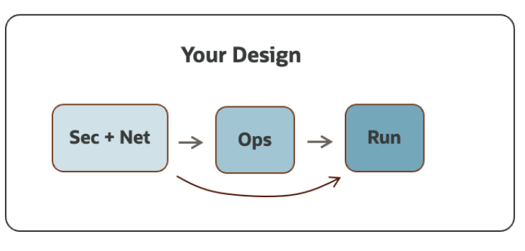

# OCI Open LZ Blueprint

Welcome to the OCI Open LZ, the Operating Entities Landing Zone, a runnable blueprint, to simplify the onboarding of organizations, business units, and subsidiaries into OCI.

The purpose of the OCI Open LZ is to:

  1. Provide an end-to-end **landing zone design**, ready to onboard an enterprise organization and its functional divisions – identified as **operating entities (OE)** with their teams, departments, and projects.
  2. Provide a cloud-native operating model to simplify and scale day two operations
  3. Demonstrate the operating model and run OCI with a **configurable Terraform approach.**
  4. Enable customers, partners, and the general IT community to create tailored landing zones with lower efforts through a comprehensive OCI reference architecture.
  5. Provide **tailoring guidelines** to help adjust the model. This asset can be used directly, tailored, or used as inspiration to create a new one – as it is not a prescribed solution.

Before starting, find below the **seven** characteristics of the OCI Open LZ.

If cloud landing zones are analogous to airports, the OCI Open LZ is a highly scalable airport with the possibility of having different terminals (OEs), that can be – but don't have to be – operated independently by different companies/subsidiaries. Each terminal can have a different security posture (domestic, international, etc.), teams, and resources, and communication between those terminals, inside or outside the airport, is possible, automated, and secured.

## Approach Considerations :

A landing zone can be set up in different ways and can take different amounts of time to implement. There are mainly two types of approaches:

- **Standard and prescribed approaches** are the recommended starting point and can take hours to days to set up. This option enables quick start cloud adoption with a set of recommended best practices with a prescriptive design. For more details on this type of approach, also known as standard landing zones, please refer to the CIS Landing Zone or OELZ.

- **Tailored approaches** focuses on creating a landing that fits your requirements completely. They usually cover security, network, and operational topics, and can onboard a complete enterprise organization with one cloud operating model. This option is recommended when the standard approach is not enough (e.g., large organizations with fine-tuned security or network requirements, large and heterogeneous workloads landscape with multi-cloud scenarios, etc.) and experience tells us it can take from days to weeks to set up – depending on requirements and team expertise.

The OCI Open LZ is an example of the outcome of the latter approach, a tailored landing zone, and one of its purposes is to help reduce the design time, associated cost, and effort.

## Tailored Landing zones :

**A tailored landing zone is a solution designed to fit specific requirements**. This approach is normally used in these use cases (but not limited to):

* **Mirroring existing landing zones** on other CSPs.
* **Onboarding and reflecting organization structures** such as business units, operating entities, OpCos, into a cloud operating model.
* **Fine-grained segregation of duties** and responsibilities across resources and teams.
* **Network structure** with **different areas and security postures**, with fine-tuned north-south and east-west traffic scenarios.
* Heterogeneous and/or large workloads landscape.
* **Adopting a highly scalable operating model**, such as control versioned operations.
 

# workflow : Design + Run :

[OCI Open LZ Blueprint] (https://github.com/oracle-quickstart/terraform-oci-open-lz) is a **reference solution** and a **repeatable design process**. It presents an end-to-end coherent solution – with the security, network, and operations views – of what an organization-wide landing zone looks like, with fine- grained segregation of duties, strong isolation of resources, and a scaleable operating model.

The benefit of this blueprint is that it can be completely adjusted and easily simplified into any other type of landing zone, by following the design steps towards your needs. 

In terms of design, this approach is simple and repeatable, and can involve the following OCI views 

- **Security View**: covering the seggregation of duties, with Tenancy Structure, IAM, and Posture Management.
- **Network View**: covering the Network Structure, Network Isolation, Connectivity, Most-Significant Traffic Scenarios, and possibly DNS.

## Network View :

## Secure View :

