# OCI Open LZ Blueprint

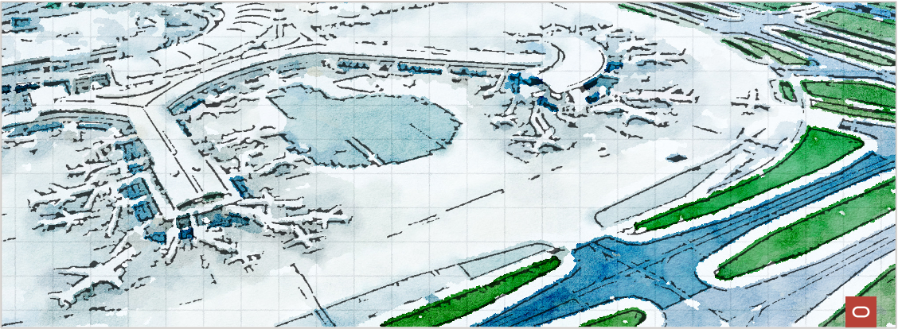

Welcome to the OCI Open LZ, the Operating Entities Landing Zone, a runnable blueprint, to simplify the onboarding of organizations, business units, and subsidiaries into OCI.

The purpose of the OCI Open LZ is to:

  1. Provide an end-to-end **landing zone design**, ready to onboard an enterprise organization and its functional divisions – identified as **operating entities (OE)** with their teams, departments, and projects.
  2. Provide a cloud-native operating model to simplify and scale day two operations.
  3. Demonstrate the operating model and run OCI with a **configurable Terraform approach.**
  4. Enable customers, partners, and the general IT community to create tailored landing zones with lower efforts through a comprehensive OCI reference architecture.
  5. Provide **tailoring guidelines** to help adjust the model. This asset can be used directly, tailored, or used as inspiration to create a new one – as it is not a prescribed solution.

Before starting, find below the **seven** characteristics of the OCI Open LZ.

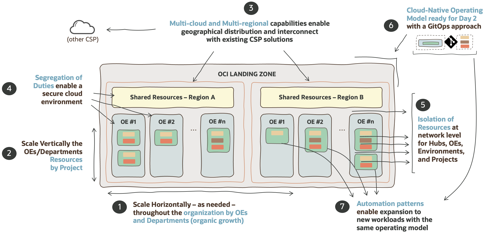

If cloud landing zones are analogous to airports, the OCI Open LZ is a highly scalable airport with the possibility of having different terminals (OEs), that can be – but don't have to be – operated independently by different companies/subsidiaries. Each terminal can have a different security posture (domestic, international, etc.), teams, and resources, and communication between those terminals, inside or outside the airport, is possible, automated, and secured.

## Approach Considerations :

A landing zone can be set up in different ways and can take different amounts of time to implement. There are mainly two types of approaches:

- **Standard and prescribed approaches** are the recommended starting point and can take hours to days to set up. This option enables quick start cloud adoption with a set of recommended best practices with a prescriptive design. For more details on this type of approach, also known as standard landing zones, please refer to the CIS Landing Zone or OELZ.

- **Tailored approaches** focuses on creating a landing that fits your requirements completely. They usually cover security, network, and operational topics, and can onboard a complete enterprise organization with one cloud operating model. This option is recommended when the standard approach is not enough (e.g., large organizations with fine-tuned security or network requirements, large and heterogeneous workloads landscape with multi-cloud scenarios, etc.) and experience tells us it can take from days to weeks to set up – depending on requirements and team expertise.

The OCI Open LZ is an example of the outcome of the latter approach, a tailored landing zone, and one of its purposes is to help reduce the design time, associated cost, and effort.

## Tailored Landing zones :

**A tailored landing zone is a solution designed to fit specific requirements**. This approach is normally used in these use cases (but not limited to):

* **Mirroring existing landing zones** on other CSPs.
* **Onboarding and reflecting organization structures** such as business units, operating entities, OpCos, into a cloud operating model.
* **Fine-grained segregation of duties** and responsibilities across resources and teams.
* **Network structure** with **different areas and security postures**, with fine-tuned north-south and east-west traffic scenarios.
* Heterogeneous and/or large workloads landscape.
* **Adopting a highly scalable operating model**, such as control versioned operations.
 

# workflow : Design + Run :

In order to deploy you own Open LZ you need to review first the design that it is proposed. 

After undestand the solution you will be able to run it.

# Design 

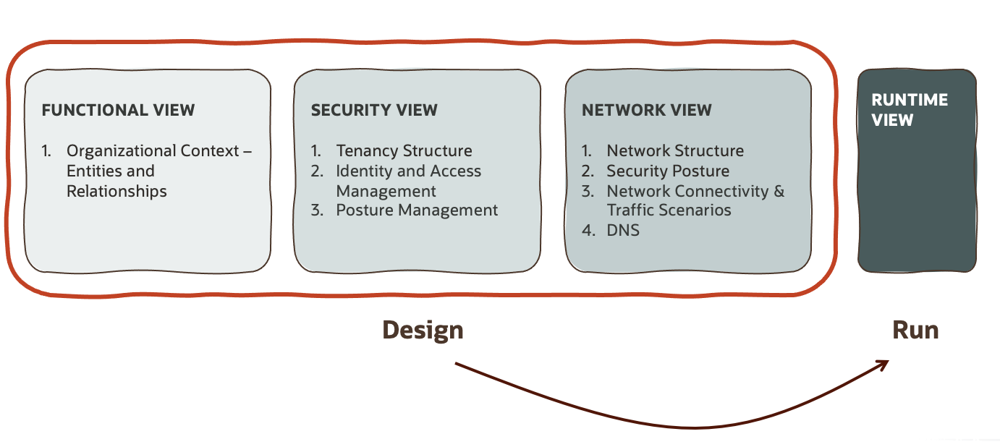

[OCI Open LZ Blueprint](https://github.com/oracle-quickstart/terraform-oci-open-lz) is a **reference solution** and a **repeatable design process**. It presents an end-to-end coherent solution – with the security, network, and operations views – of what an organization-wide landing zone looks like, with fine- grained segregation of duties, strong isolation of resources, and a scaleable operating model.

The benefit of this blueprint is that it can be completely adjusted and easily simplified into any other type of landing zone, by following the design steps towards your needs. 

In this LiveLab we will cover this two main layers:

- **Functional View**:Present the key organizational entities of the OCI Open LZ and how they relate to each other.
- **Security View**: covering the seggregation of duties, with Tenancy Structure, IAM, and Posture Management.
- **Network View**: covering the Network Structure, Network Isolation, Connectivity, Most-Significant Traffic Scenarios, and possibly DNS.

## Functional View :

Entities and Relationships
This Landing Zone pattern is driven by Operating Entities (OE), the higher unit of landing zone resource aggregation. This resource aggregation requires a shared operating model with several levels of responsibility:

1. **Central IT Responsibility (Central Operations – 1 Team)**: these resources will be operated by a Central IT Operations team which will be completely responsible for the landing zone shared elements.

2. **Operating Entities Responsibility (OE Operations – N Teams)**: these resources will be operated by each OE, including onboarding their departments and projects. A project will contain a set of OCI resources including applications, databases, and related infrastructure.

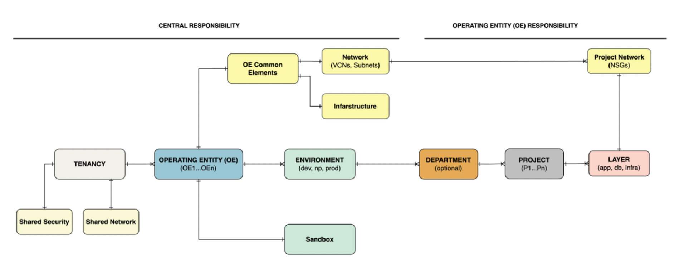

## Secure View :

A good security design implies a good tenancy design. The Open LZ blueprint cover these points:

* **Tenancy Structure** presents the compartment structure to support resource grouping, separation of duties, and budget control and billing.

* **Identity and Access Management** defines the groups, dynamic groups, and policies for the related duties and compartments.

* **Configuration and Posture Management** describes the additional configurations for native security tooling used in this pattern.

* **Design Considerations** presents guidelines complementing or extending this design.

**Tenancy Structure**

 An OCI tenancy structure has OCI compartments, groups, and policies as core resources. Compartments provide the ability to organize and isolate resources in an OCI tenancy and play an essential role in setting a foundation for deploying workloads. Although they may appear to have the nature of logical grouping of OCI resources, they serve as policy enforcement points, thus they have paramount importance concerning the tenancy’s security.
Compartments can be deployed according to a functional, operational, or project hierarchy. This allows for maintaining isolation between resources for different roles, functions, and organizational hierarchies. A compartment hierarchy can have up to 6 levels, based on the requirements. Access control is defined by policies, which are associated with compartments.

The compartment structure of the OCI Open Landing Zone reflects the following design principles regarding segregations of resources and duties:

* P1: Segregation between Shared Resources and Operating Entities elements (e.g., OE01, OE02, etc.)

* P2: Segregation among Operating Entities and their potential departments, reflecting customer organizational structure (e.g., OE01, OE02, etc.)

* P3: Segregation of environments like Production and Non-production environments

* P4: Segregation among applications/projects belonging to departments.

* P5: Segregation among application layers (App, DB, and Infra) belonging to applications/projects
  
The diagram below presents the tenancy structure for Level 1 (L1), associated with principle P1 identified above, separating the shared resources area (in pale yellow) operated by the parent company, and the N possible operating entities areas (in blue tones), that each OE will be responsible for operating their resources.

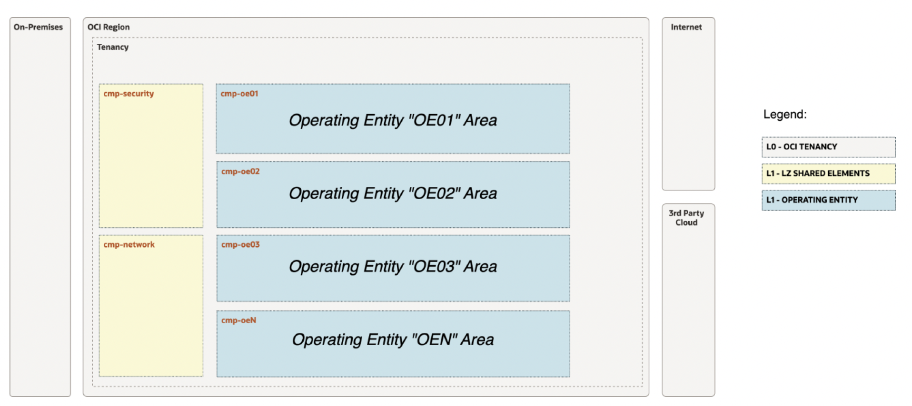

Expanding the tenancy structure into Levels 1, 2, and 3 (L1, L2, and L3) as shown in the architecture below. it includes a shared compartment for each OE and is complemented by three types of environments: sandbox, non-production, and production (in green).

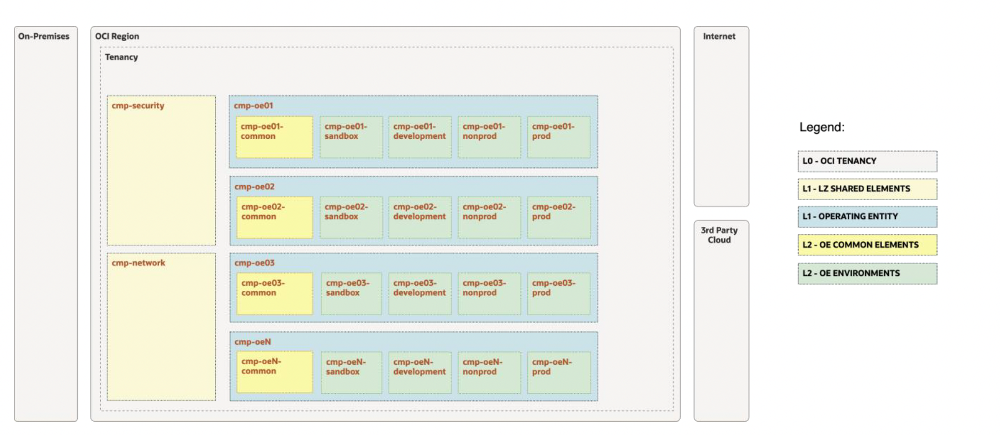

The diagram below presents a zoom on the tenancy structure for an Operating Entity named "OE01" from L1 to L5 elements. All OEs will have this same structure

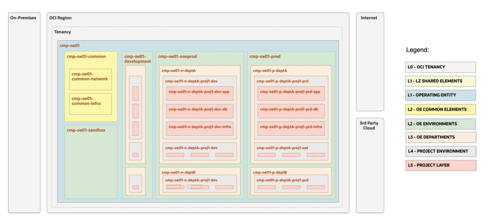

**Identity Management**

Identity and Access Management design define the groups and policies defined for the tenancy. A good design includes the segregation of duties and applies to any usage scenario.
As a general principle, groups follow the least privilege principle. However, users can be members (but rarely should be) of multiple groups if needed.
This pattern uses the groups and policies implemented by the CIS Landing Zone (Standard Landing Zone), plus the OE-specific groups and policies.
Operation roles can combine these roles if needed.

**Configuration and Posture Management and Design Considerations** 
  
To check more details about specific groups, dynamic groups, policies, secure posture management or other considerations we recommend to check the [OCI Open LZ Blueprint] (https://github.com/oracle-quickstart/terraform-oci-open-lz)

## Network View :

All the network elements of the OCI Open LZ, and it’s organized into five sections:

* **Network Structure** presents all the most-significant network components, their relations, and objectives.

* **Network Security** presents the network areas and their related security posture.

* **Network Connectivity** presents how the OCI Open LZ can be connected to on-premises and other cloud providers and describes the most significant network traffic (the network use cases) with a north-south and east-west pattern.

* **DNS** presents the naming resolution use cases and how DNS zones and records are solved to handle domain DNS queries.

* **Design Consideration** presents topics to consider when using, adjusting, or changing this design.

**Network Structure**

The OCI Open LZ network structure has the following components:

1. The OCI Open LZ contains a central network and OE-level network resources, following a Hub & Spoke topology, where an Operating Entity (OE) is a logical spoke.

2. The Hub contains a central DRG, a central VCN, several Subnets, and capabilities to provide traffic inspection, load-balancing, and DNS.

3. Each OE has a set of dedicated VCNs: a common network area (for possible OE-dedicated inspection, load-balancing, and DNS), a sandbox area, and three environments: development, non-production, and production.

4. Each OE Environment VCN has three Subnets, one for each project layer: App, DB, and Infra.

5. For each Subnet, there is a common set of ingress rules handled by Security Lists.

6. For each OCI Open LZ Project, there will be three Network Security Groups (NSG), one per Project Layer: App, DB, and Infra. With the use of NSGs it’s possible to separate project security requirements from the VCNs and Subnets architecture

The following diagram presents an example of the central network components and an OE named "OE01" network components.

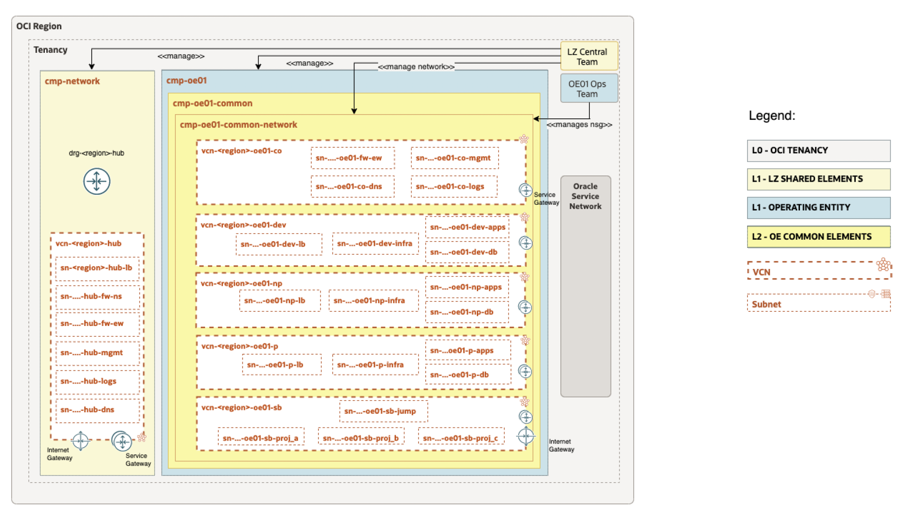

The diagram below presents how this design is extended to another OE, OE2 in this example. Please note that the following sections do not include this example with a second OE.

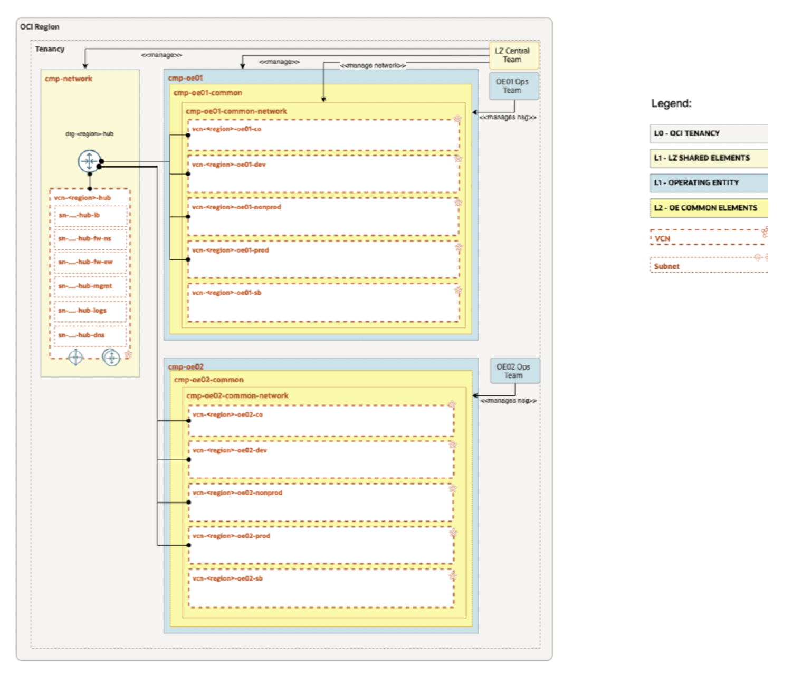

**Network Security**

The OCI Open LZ has four network areas which are presented and described in the next diagram and table, respectively.

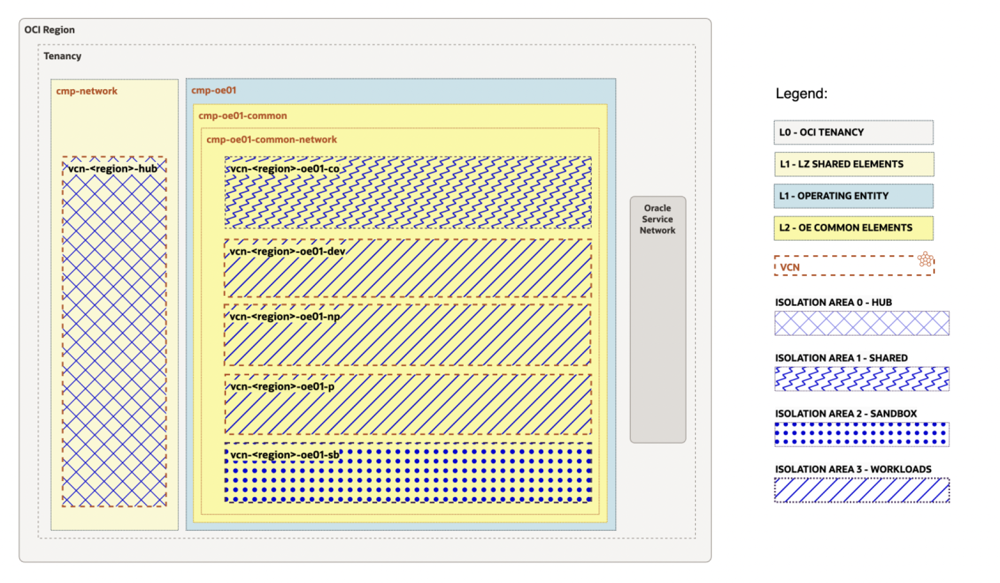"OCI OpenLZ Network Areas")

**Network Connectivity and Design Consideration** 
  
To check more details these areas we recommend to check the [OCI Open LZ Blueprint] (https://github.com/oracle-quickstart/terraform-oci-open-lz)

# Run

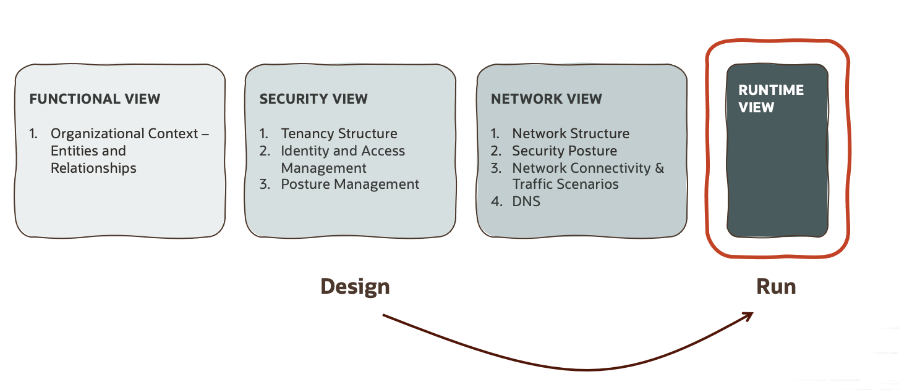

# Other Considerations :

Note that the alternative for not using the configurable approach described is to code your own solution, from zero or reuse existing modules. The CIS Landing Zone Enhanced Modules allow any configuration topology and allow to focus on business resources (workloads) instead of investing time coding to create OCI core resources. By using the recommended approach it's possible to avoid the common pitfalls associated with complex customizations:

* **Hard-coding**. Changing or adapting code to create a new landing zone different than the original is complex and time-consuming. This also means that any change to the landing zone will be executed by code and not configurations.
* **Waste & Late Time-to-Value**. The time spent on adapting code, or re-coding over and over for the OCI landing/core resources is time wasted and not used on the business value/workloads.
* **Limited Scaling**. Doing OCI changes manually can work for some tactical solutions, but it will always limit the scaling and add complexity and cost to the day-two operations. Note that, for example, CIS LZ creates 100+ OCI resources.

* **Scarce Skills**. IaC Terraform coding skills are not as common as we should expect, which makes these efforts a higher risk and challenge to solve.

